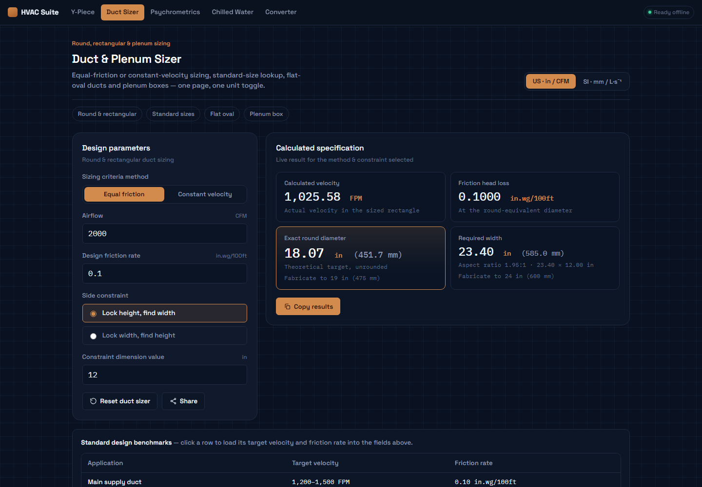
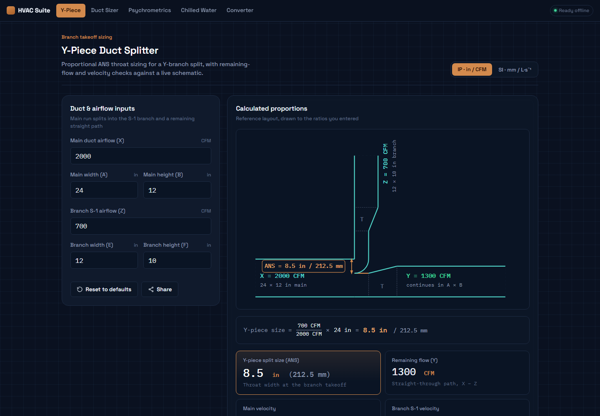
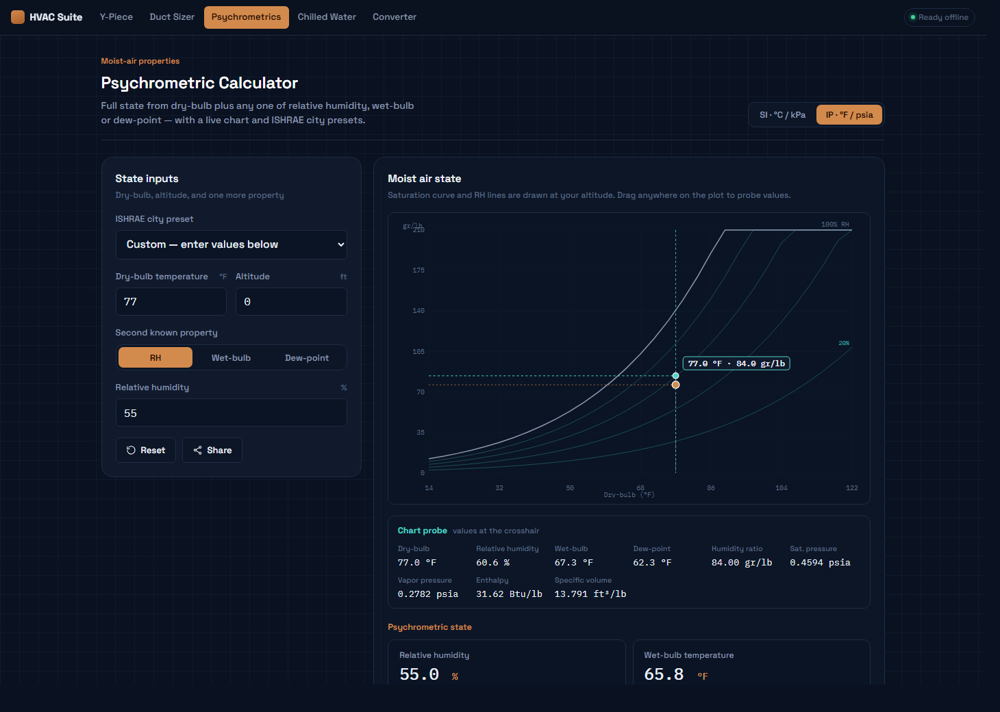
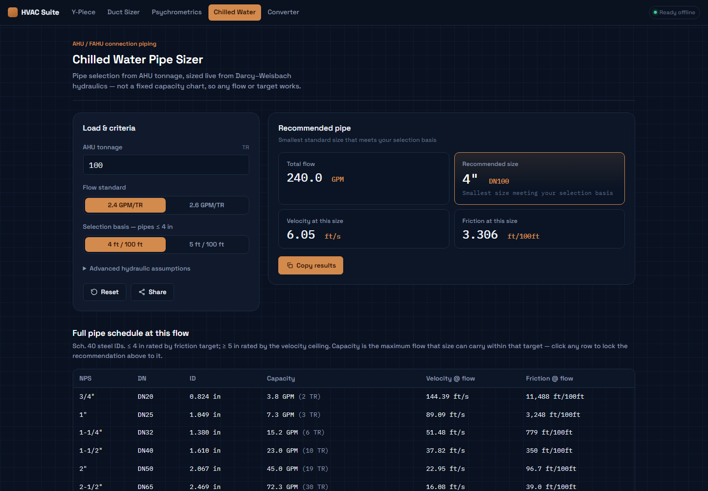
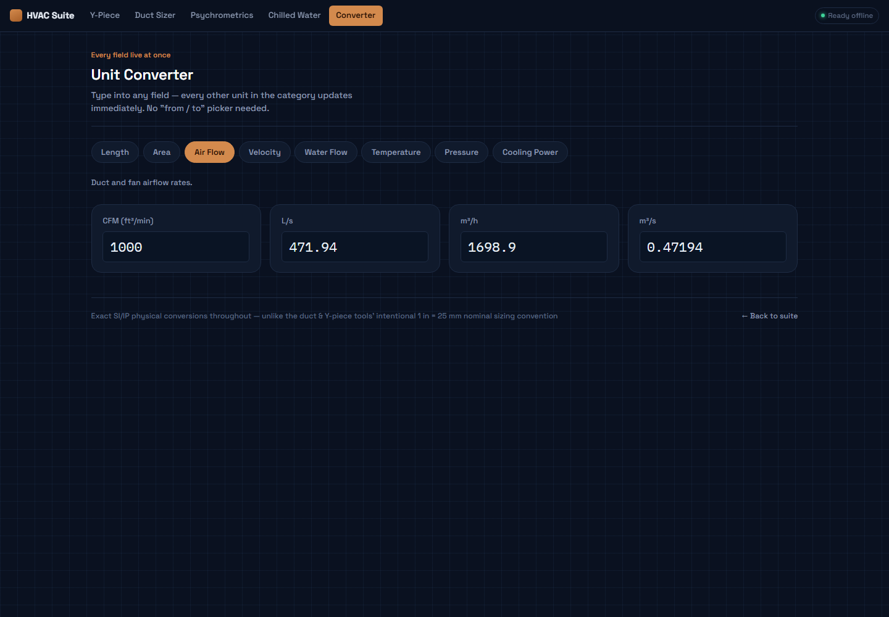
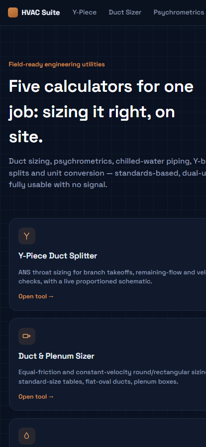
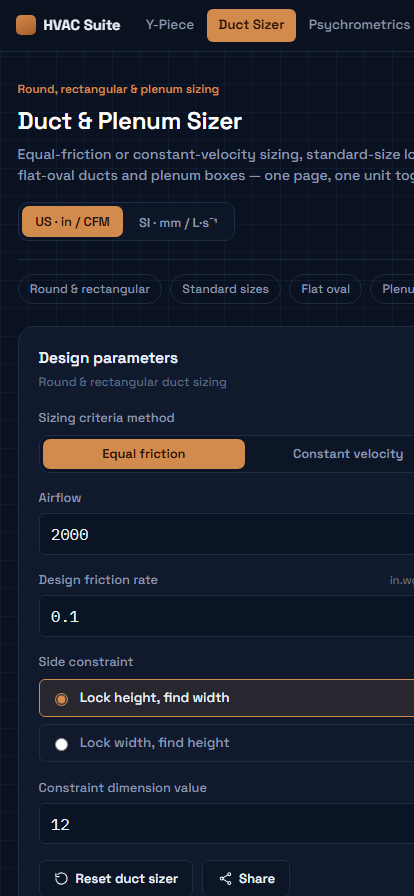

# HVAC Design Suite

Five offline-first HVAC engineering calculators, built as plain HTML/CSS/JS with no
build step and no runtime dependencies. Installable as a PWA; everything keeps
working with no signal once it has been opened once.

### ▶️ Live application: **https://shaikhnedab.github.io/hvac/**

Repository: **https://github.com/shaikhnedab/hvac**

---

## Screenshots

**Dashboard**


**Duct & Plenum Sizer** — equal-friction sizing with a click-to-lock catalog table



**Y-Piece Duct Splitter** — live proportioned schematic with the ANS throat callout



**Psychrometric Calculator** — saturation curve, RH reference lines, state point



**Chilled Water Pipe Sizer** — live Darcy–Weisbach hydraulics, click-to-lock schedule



**Unit Converter** — every field in a category live at once



**Responsive layout** — the same tools collapse cleanly to a phone

<p align="center">
  
  
</p>

---

## Quick start

Everything is live at **[shaikhnedab.github.io/hvac](https://shaikhnedab.github.io/hvac/)** —
no install, no sign-up.

1. **Pick a tool** from the dashboard, or use the sticky nav bar at the top of any page.
2. **Type your values.** Every readout recalculates live — there is no Calculate button.
3. **Switch units** with the segmented control in each tool's header (IP ⇄ SI). Your
   entered values are converted, not reset, and the result stays the same case.
4. **Click any row in a standard-size table** to lock the whole calculation to that
   real, buyable catalog dimension and see the resulting velocity and friction. Click
   the highlighted row's *use calculated size* link to release the lock.
5. **Copy** any result block to the clipboard, or **Share** to copy a link that encodes
   the entire case — send a colleague the exact scenario, not a screenshot.
6. **Install it** (Chrome/Edge: install icon in the address bar; iOS Safari: Share →
   Add to Home Screen) for a standalone app window with app shortcuts to all five tools.

### Sharing a calculation

Every calculation tool has a **Share** button. It writes the current inputs and unit
system into the URL and copies it:

```
https://shaikhnedab.github.io/hvac/duct-sizer/?unit=ip&method=ef&dQ=2000&dF=0.1&dLock=12
```

Opening that link restores the exact case, including the locked catalog size. Tool
inputs also persist locally, so returning to a tool brings back what you last typed.

### Conventions worth knowing

- **Duct and pipe cross-section sizing uses the nominal `1 in = 25 mm` rule**, so rounded
  metric and inch product sizes line up. This applies to *sizes* only.
- **Everything else converts exactly** — velocity, friction rate, altitude, temperature,
  pressure, airflow. Duct friction converts at the true physical `8.172 Pa/m per
  in.wg/100 ft`.
- **Results show both units** for duct and Y-piece sizes, plus a *Fabricate to* line that
  rounds up to a whole purchasable dimension (duct sizes are cut from stock).
- The **Unit Converter is exact throughout** (`1 in = 25.4 mm`) since it isn't tied to
  nominal product sizing.

### Running it locally

No build step — serve the folder with any static server:

```bash
python -m http.server 8000
# then open http://127.0.0.1:8000/
```

Opening `index.html` directly from disk also works, though a local server is
recommended so the service worker and share links behave normally.

---

## The tools

| Tool | Path | What it does |
|---|---|---|
| Y-Piece Duct Splitter | `/y-piece/` | ANS throat sizing for a branch takeoff, remaining-flow and three velocity checks, live SVG schematic |
| Duct & Plenum Sizer | `/duct-sizer/` | Equal-friction / constant-velocity round & rectangular sizing, standard-size tables, flat-oval ducts, plenum boxes |
| Psychrometric Calculator | `/psychrometrics/` | Full moist-air state from dry-bulb + RH/WB/DP, live psychrometric chart, ISHRAE city presets |
| Chilled Water Pipe Sizer | `/chilled-water/` | AHU tonnage → pipe size, from live Darcy–Weisbach hydraulics |
| Unit Converter | `/converter/` | Length, area, air flow, velocity, water flow, temperature, pressure, cooling power — every field live at once |

---

## What changed in this pass

This was a rebuild on top of the original suite's scope and formulas, not just a
re-skin. Roughly in order of how much it matters day to day:

**New engineering capability**
- The **chilled-water sizer** no longer reads from a fixed capacity chart — it solves
  Darcy–Weisbach (Swamee–Jain friction factor, commercial-steel roughness) live for
  every standard pipe size, so it works at *any* flow, not just the rows that happened
  to be tabulated. It still reproduces the chart's original anchor points (208 TR at
  5″, ~1,163–1,174 TR at 12″).
- The **psychrometric calculator** gained a live chart (saturation curve + 20/40/60/80%
  RH reference lines + your state point, at your actual altitude) and the SI/IP enthalpy
  readouts now use the two *native* ASHRAE formulas rather than a naive kJ/kg→Btu/lb
  conversion — those formulas use different reference datums, so a straight unit
  conversion between them would have quietly been wrong.
- The **duct sizer** and **chilled-water sizer** standard-size tables are now
  interactive: click a catalog row to lock the whole calculation to that real, buyable
  size and see the resulting velocity/friction, instead of only ever seeing the
  unrounded theoretical target.
- The **Y-piece tool** adds a fourth velocity check (the remaining/through duct
  downstream of the split) alongside main and branch velocity.

**Every tool, consistently**
- Inputs persist locally between visits, and a *Share* button encodes the current case
  into the URL — send a colleague the exact scenario, not a screenshot.
- A single, audited set of unit-conversion constants is shared across every tool
  (`assets/app.js`). See *Conventions worth knowing* above for exactly where the
  nominal `1 in = 25 mm` rule applies and where conversion is exact.
- Fabricated duct and plenum dimensions are rounded **up** to whole stock sizes and shown
  alongside the exact theoretical target, so you can see both the design value and what
  to actually order.
- Copy-to-clipboard, keyboard-accessible forms, visible focus states, and `aria-live` on
  warnings.
- One shared stylesheet/script instead of per-page duplication, so the suite is one
  visual system rather than five similar-looking pages.

**PWA**
- Proper icon set (16/32/192/512/maskable) plus app shortcuts to all five tools.
- Versioned, cache-first service worker with automatic old-cache cleanup.

---

## Why the numbers can be trusted

Every formula was checked against the original methodology and, where possible,
cross-checked against known reference values before being wired into the UI. The
specific regression tests that run on each change:

- Sea-level barometric pressure round-trips to exactly **14.696 psia**.
- A 5″ pipe at 2.4 GPM/TR lands on exactly **208 TR**.
- IP ⇄ SI toggles round-trip a case back to its original numbers, including the locked
  catalog size and every *Fabricate to* value.
- Altitude-corrected psychrometrics, and both native enthalpy forms.
- Fabricated dimensions round up to whole units, with float-noise tolerance so an
  IP→SI→IP round trip can't jump a size.

The one deliberately-approximate area — ISHRAE city preset values — is labeled as
representative in the UI, because exact 1% design DB/MWB figures depend on which
handbook edition you're citing.

---

## Architecture

```
index.html            Landing page
404.html                Shown for unknown paths; maps old /y/ /duct/ … URLs to the renamed folders
manifest.webmanifest   PWA manifest (icons, shortcuts)
sw.js                  Cache-first service worker
assets/
  theme.css             Design tokens + shared components (nav, cards, forms, tables, charts)
  app.js                Shared utilities: persistence, share-links, toasts, unit constants, icons
icons/                  SVG + PNG icon set (192/512/maskable/apple-touch/favicons)
screenshots/            README screenshots
y-piece/     duct-sizer/     psychrometrics/     chilled-water/     converter/
  index.html            Each tool is self-contained: shared theme.css/app.js + its own inline logic
```

Tool folders are named for readable URLs, but a tool's identity is the `data-tool`
attribute on its nav link — never the folder name. Renaming a folder is therefore a
path-only change that can't break the "last used" badge or persistence. (The
`inputs:*` localStorage keys are also path-independent, so saved cases survive a
rename.)

`404.html` and the PWA paths assume the suite is served from `/hvac/`; update the
`/hvac/` prefix in that file if the repo name or hosting path changes.

No bundler, no package.json, no node_modules. Open any `index.html` directly or serve
the folder with anything static (`python -m http.server`, GitHub Pages, Netlify, etc.).

Deployment is automated: pushing to `master` triggers
[`.github/workflows/static.yml`](.github/workflows/static.yml), which publishes the
repository to GitHub Pages.

---

## Reference

- Duct sizing: SMACNA *HVAC Systems Duct Design*, ASHRAE rectangular equivalent
  diameter, Heyt & Diaz flat-oval correlation.
- Psychrometrics: Magnus saturation approximation, ISA barometric formula, ASHRAE
  moist-air enthalpy (SI and IP forms).
- Chilled water: Darcy–Weisbach with the Swamee–Jain explicit friction factor,
  commercial-steel absolute roughness (0.00015 ft).

Each tool's footer states its exact formula set. Where an assumption is editable
(friction basis, max velocity), it's exposed in the UI rather than buried in the code —
verify it against your project's spec before issuing drawings.
